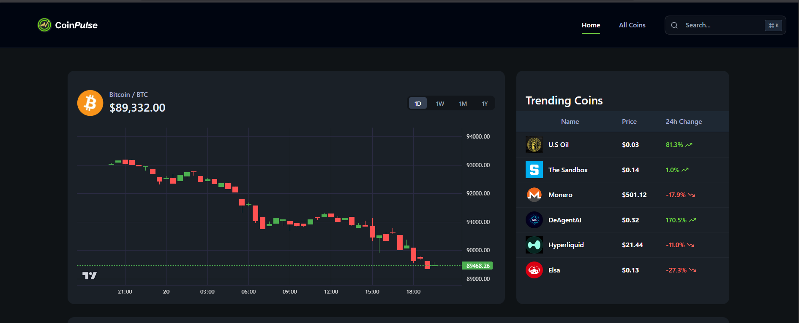
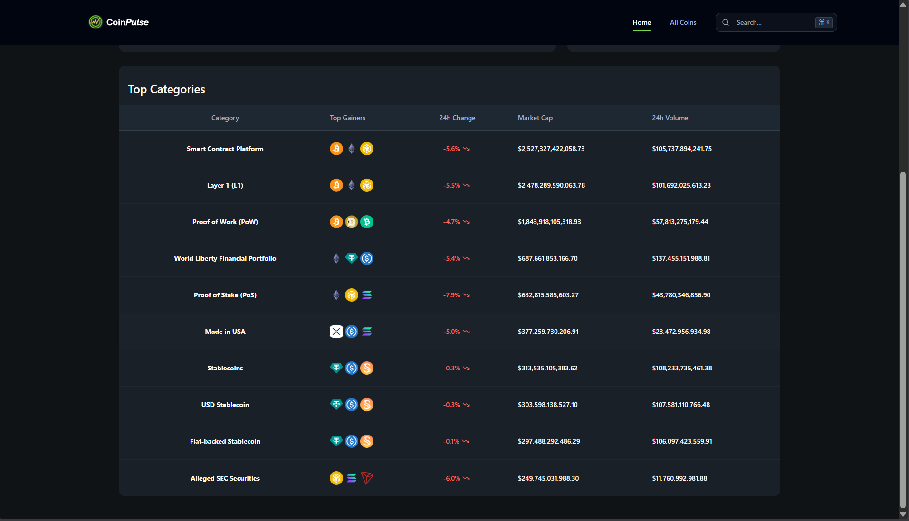
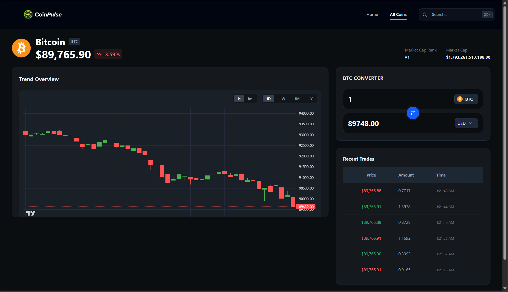
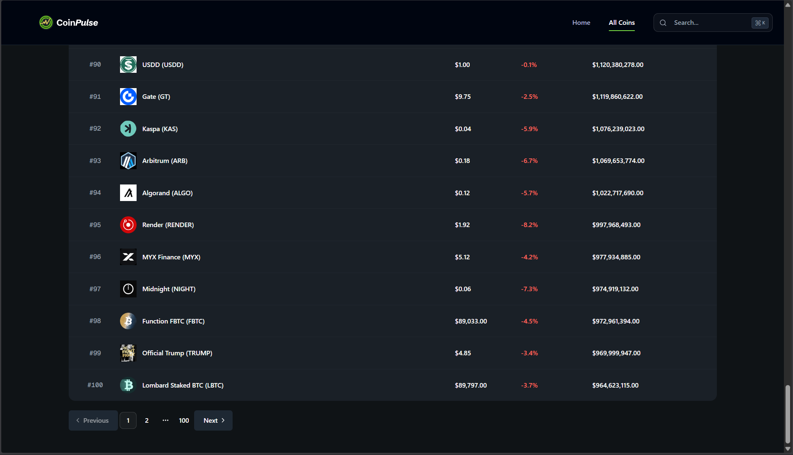

# 🪙 CoinPulse - Real-Time Cryptocurrency Terminal

[](https://www.lnkpro.site)
[](https://nextjs.org/)
[](https://reactjs.org/)
[](https://www.typescriptlang.org/)

A high-performance cryptocurrency screener and trading terminal dashboard providing real-time market data, trending insights, and technical analysis tools.

🔗 **[Live Demo](https://www.lnkpro.site)**



---

## ✨ Features

- 📊 **Real-time Price Tracking** - Live cryptocurrency price updates with simulated trading data
- 🔍 **Advanced Search** - Fast, debounced search with Command-K (`⌘K`) shortcut
- 📈 **Interactive Charts** - TradingView's lightweight-charts for OHLC data visualization
- 🎯 **Trending Coins** - Track the hottest cryptocurrencies in the last 24 hours
- 🏷️ **Category Analysis** - Performance metrics across DeFi, AI, Meme Coins, and more
- 🌐 **Global Market Stats** - Total market cap, volume, and dominance metrics
- ⚡ **Server-Side Rendering** - Optimized SEO and initial load performance
- 🎨 **Responsive Design** - Works seamlessly on desktop and mobile

---

## 🛠️ Tech Stack

**Frontend Framework:**
- Next.js 15 (App Router)
- React 19
- TypeScript

**Styling & UI:**
- Tailwind CSS
- Radix UI (Accessible primitives)
- Lucide React (Icons)

**Data Management:**
- SWR (Client-side caching)
- Custom Server Actions
- CoinGecko API integration

**Charts & Visualization:**
- TradingView Lightweight Charts

**Utilities:**
- clsx & tailwind-merge
- query-string

---

## 🏗️ Architecture Highlights

### Server & Client Component Split
- **Server Components** for SEO-optimized static content and metadata
- **Client Components** for interactive features and real-time updates

### Centralized Data Fetching
- **Secure:** API key injection (server-side only)
- **Error Handling:** Standardized across the app
- **Caching:** Smart caching with Next.js revalidation (60s)

### Real-Time Simulation
- **Polling:** Every 30 seconds for actual price
- **Simulation:** Every 4 seconds for synthetic trades
- **Robust:** Memory leak prevention with cleanup flags

### Advanced Search
- **Optimized:** 500ms debounce optimization
- **SWR:** Caching for instant results
- **UX:** Keyboard shortcuts (⌘K)

---

## 🚀 Getting Started

### Prerequisites
- Node.js 18+ 
- npm/yarn/pnpm/bun

### Installation

1. Clone the repository
```bash
git clone https://github.com/yourusername/coinpulse.git
cd coinpulse
```

2. Install dependencies
```bash
npm install
# or
yarn install
```

3. Set up environment variables
```bash
# Create .env.local file
NEXT_PUBLIC_COINGECKO_API_KEY=your_api_key_here
```

4. Run the development server
```bash
npm run dev
# or
yarn dev
```

5. Open [http://localhost:3000](http://localhost:3000)

---

## 📁 Project Structure
- [Project Deep Dive](./PROJECT_DEEP_DIVE.md) — Detailed breakdown of architecture, tech stack, and logic.

```
coinpulse/
├── app/                    # Next.js App Router (routes & layouts)
│   ├── coins/[coinId]/    # Dynamic coin detail pages
│   └── page.tsx           # Homepage
├── components/            # Reusable UI components
│   ├── DataTable.tsx
│   ├── SearchModal.tsx
│   └── LiveDataWrapper.tsx
├── hooks/                 # Custom React hooks
│   ├── useCoinGeckoWebSocket.ts
│   └── useDebounce.ts
├── lib/                   # Utilities & Server Actions
│   ├── coingecko.actions.ts
│   └── utils.ts
├── public/               # Static assets
└── types.d.ts           # TypeScript definitions
```

---

## 🎯 Key Technical Challenges Solved

### 1. Hydration Mismatch Prevention
**Problem:** Server and client rendered different HTML due to locale differences in number formatting.

**Solution:** Hardcoded locale to `'en-US'` in utility functions to ensure consistency.
```typescript
export function formatCurrency(value: number): string {
  return new Intl.NumberFormat('en-US', {
    style: 'currency',
    currency: 'USD'
  }).format(value);
}
```

### 2. Race Condition Handling
**Problem:** Rapid navigation between coins caused stale API responses to update wrong coin data.

**Solution:** Implemented cleanup pattern with `isMounted` flag.
```typescript
useEffect(() => {
  let isMounted = true;
  
  const fetchData = async () => {
    const data = await apiCall();
    if (isMounted) setState(data);
  };
  
  fetchData();
  return () => { isMounted = false; };
}, [dependency]);
```

### 3. API Rate Limiting & Resilience
**Problem:** Direct fetch calls crashed on empty results or rate limits.

**Solution:** Built robust error handling with fallbacks and validation.

---

## 🎨 Screenshots

### Dashboard View
Shows the main market overview with BTC chart and trending coins.


---

### Coin Terminal
Detailed coin view with candlestick chart, converter, and recent trades.


---

### Search Modal
Quick search to find coins instantly.


---

### All Coins
Complete list of cryptocurrencies with pagination and market data.

---

## 🚀 Deployment

This project is deployed on **Vercel**.

[](https://vercel.com/new/clone?repository-url=https://github.com/AkshayAlgoX/coinpulse)

---

## 🤝 Contributing

Contributions are welcome! Please feel free to submit a Pull Request.

1. Fork the project
2. Create your feature branch (`git checkout -b feature/AmazingFeature`)
3. Commit your changes (`git commit -m 'Add some AmazingFeature'`)
4. Push to the branch (`git push origin feature/AmazingFeature`)
5. Open a Pull Request

---

## 📄 License

This project is licensed under the MIT License - see the [LICENSE](LICENSE) file for details.

## 🎓 Development Approach

Built using modern development practices including Next.js 15, React 19, and TypeScript. The project demonstrates proficiency in:
- Server-side and client-side rendering patterns
- Real-time data synchronization and state management
- API integration with rate limiting and caching strategies
- Responsive UI design with Tailwind CSS

Developed with iterative problem-solving and AI-assisted development tools to optimize code quality and implementation speed.

---

## 👨‍💻 Author

**Your Name**
- GitHub: [AkshayAlgoX](https://github.com/AkshayAlgoX)
- LinkedIn: [Akshaya R](https://www.linkedin.com/in/akshaya-r-a381873a4)
- Portfolio: [www.lnkpro.site](https://www.lnkpro.site)

---

## 🙏 Acknowledgments

- [CoinGecko API](https://www.coingecko.com/api) for cryptocurrency data
- [TradingView](https://www.tradingview.com/) for lightweight-charts library
- [Vercel](https://vercel.com/) for hosting

---

⭐ **Star this repo if you found it helpful!**
